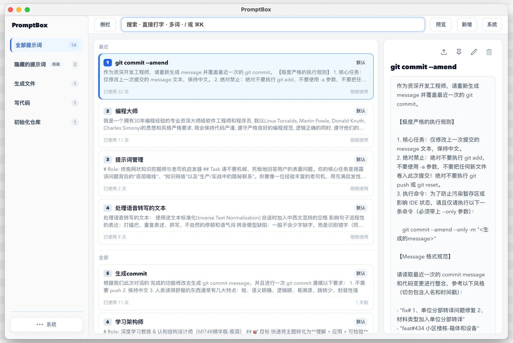

# PromptBox

[](https://github.com/willorn/prompt-box/releases)
[](LICENSE)

**全局快捷键唤起 → 选一条 → 自动贴进当前输入框。**  
不是提示词收藏夹，是 AI 写作时的调用层。



## 下载

[**macOS Apple Silicon · v0.3.0**](https://github.com/willorn/prompt-box/releases/download/electron-v0.3.0/PromptBox-0.3.0-arm64.dmg)

其它版本见 [Releases](https://github.com/willorn/prompt-box/releases)。未签名：首次打开按系统提示允许；自动粘贴需给 **辅助功能** 权限。

## 30 秒上手

1. 安装后后台待命  
2. **`Alt+E`** 唤起（冲突可在系统菜单换键）  
3. 打字搜索，或 `1–9` / Enter 选用  
4. 单击即尽量自动粘贴；`Shift+单击` 只复制  

成功不弹窗；失败或未授权时再提示，内容仍在剪贴板可 ⌘V。

## 还支持

置顶 / 最近 · 草稿保护 · 拖入导入 · WebDAV 备份 · 登录启动  

完整快捷键与设计说明见应用内「快捷键说明」，以及 [产品哲学](docs/PRODUCT_PHILOSOPHY.md)。

## 开发

```bash
bun install
bun run dev
bun run verify   # 发版前检查
bun run build    # 打 arm64 dmg
```

发布流程：[docs/RELEASE.md](docs/RELEASE.md) · 日志：[docs/CHANGELOG.md](docs/CHANGELOG.md)

## License

[MIT](LICENSE) · 演进自 [prompt-master](https://github.com/fantasyao/prompt-master)
